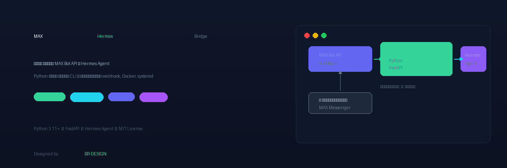

<div align="center">

  

  <br/>
  
  
  
  
  
  
  
  
  
  
  

  <h3>Мост между <a href="https://dev.max.ru">MAX Bot API</a> и <a href="https://hermes-agent.nousresearch.com">Hermes Agent</a></h3>
  <p>Python-мост через CLI с поддержкой webhook, Docker и systemd</p>

  <table>
    <tr>
      <td width="50%" align="center">
        <h4>🇷🇺 Российская разработка</h4>
        <p>Сделано в Кремёнках · Open source · MIT</p>
      </td>
      <td width="50%" align="center">
        <h4>🎨 Designed by <a href="https://br-design.ru/">BR-DESIGN</a></h4>
        <p>Дизайн, брендинг, визуальный стиль</p>
      </td>
    </tr>
  </table>

</div>

<br>
<video src="assets/best_video.mp4" controls width="100%" loop autoplay muted></video>
<br>
<p align="center"><em>AI-generated showcase animation</em></p>
<br>

<details>
<summary>🎬 Ещё демо</summary>
<br>
<video src="assets/demo_video_2.mp4" controls width="100%" loop autoplay muted></video>
<br>
<p align="center"><em>AI-generated showcase animation</em></p>
</details>

---

## 📋 Содержание

- [Архитектура](#-архитектура)
- [Возможности](#-возможности)
- [Bot Commands Menu](#-bot-commands-menu)
- [Требования](#-требования)
- [Установка](#-установка)
- [Настройка](#-настройка)
- [Запуск](#-запуск)
- [Структура проекта](#-структура-проекта)
- [Переменные окружения](#-переменные-окружения)
- [Сравнение с Telegram Bot API](#-сравнение-с-telegram-bot-api)
- [Тестирование](#-тестирование)
- [Устранение неполадок](#-устранение-неполадок)
- [Релизы и CI/CD](#-релизы-и-cicd)
- [Лицензия](#-лицензия)

---

## 🏗️ Архитектура

```
┌──────────┐   webhook    ┌─────────────┐   CLI/SUB    ┌──────────────┐
│          │ ──────────►  │             │ ──────────►  │              │
│ MAX Bot  │              │ MAX Bridge  │              │ Hermes Agent │
│ API      │ ◄──────────  │ (Python)    │ ◄──────────  │              │
│          │  send_msg    │             │  response    │              │
└──────────┘              └─────────────┘              └──────────────┘
```

1. Пользователь пишет боту в MAX (или выбирает команду из меню)
2. MAX API отправляет webhook на мост
3. Мост обрабатывает команды `/start`, `/help`, `/about` напрямую
4. Остальные сообщения — мост показывает индикатор «Печатает...»
5. Мост вызывает Hermes Agent через CLI
6. Ответ Hermes отправляется обратно в MAX через Bot API

> **Хотите интеграцию уровня Hermes (send_message, cron, sessions)?** Используйте [MAX Hermes Plugin](https://github.com/RuslanStrogov/max-hermes-plugin) — нативный платформенный адаптер для Hermes Gateway.

## ✨ Возможности

### Что уже работает

| Фича | Статус |
|------|--------|
| Приём сообщений от MAX через webhook | ✅ |
| Отправка ответов в MAX | ✅ |
| Индикатор «Печатает...» пока агент думает | ✅ |
| **Bot Commands Menu (/start, /help, /about)** | ✅ |
| **Регистрация команд при старте (PATCH /me/commands)** | ✅ |
| **Обработка /команд без вызова Hermes** | ✅ |
| Inline keyboard (кнопки в сообщении) | ✅ |
| Callback от кнопок | ✅ |
| Поддержка нескольких пользователей | ✅ |
| Белый список пользователей (ALLOWED_USERS) | ✅ |
| Markdown-форматирование ответов | ✅ |
| systemd-сервис с автозапуском | ✅ |
| Docker / Docker Compose | ✅ |
| Health check endpoint | ✅ |
| Логирование в journald / файл | ✅ |
| Обработка всех типов событий MAX API | ✅ |
| Скачивание вложений (изображения, видео, аудио, файлы) | ✅ |
| Отправка изображений через upload API | ✅ |
| Отправка файлов через upload API | ✅ |
| Отправка голосовых сообщений (audio attachment) | ✅ |
| Редактирование сообщений (PUT /messages/{id}) | ✅ |
| Удаление сообщений (DELETE /messages/{id}) | ✅ |
| Long Polling (GET /updates) | ✅ |
| Webhook управление (POST/GET/DELETE /subscriptions) | ✅ |
| Групповые чаты (group/channel/supergroup) | ✅ |
| Маршрутизация ответов: chat_id для групп, user_id для DM | ✅ |
| События групп: user_added, user_removed, chat_title_changed | ✅ |
| Автодеплой через GitHub Actions | ✅ |
| CI (тесты на Python 3.11, 3.12) | ✅ |
| Автоматические релизы (GitHub Release) | ✅ |

## 🎛️ Bot Commands Menu

При старте мост автоматически регистрирует команды бота через `PATCH /me/commands` на `platform-api2.max.ru`.

**Зарегистрированные команды:**

| Команда | Описание |
|---------|----------|
| `/start` | Начать диалог с ботом |
| `/help` | Помощь и информация о боте |
| `/about` | О боте и его возможностях |

Команды обрабатываются **напрямую в bridge**, без вызова Hermes AI.

### Пример использования

1. Пользователь открывает диалог с ботом в MAX
2. Нажимает кнопку вызова команд (рядом с полем ввода)
3. Выбирает `/help`
4. Мост сразу отвечает справкой — без ожидания Hermes

### Регистрация при старте

```python
# main.py — добавляется после get_bot_info()
default_commands = [
    {"name": "start", "description": "Начать диалог с ботом"},
    {"name": "help", "description": "Помощь и информация о боте"},
    {"name": "about", "description": "О боте и его возможностях"},
]
await max_client.set_commands(default_commands)
```

## 📋 Требования

- Python 3.11+
- Hermes Agent (установленный и настроенный)
- Сервер с публичным IP (или tunnel) для приёма webhook
- SSL-сертификат (Let's Encrypt или самоподписанный)

## 📦 Установка

### 1. Клонирование репозитория

```bash
git clone https://github.com/RuslanStrogov/max-hermes.git
cd max-hermes
```

### 2. Создание виртуального окружения

```bash
python3 -m venv venv
source venv/bin/activate
pip install -r requirements.txt
```

### 3. Создание бота в MAX

> ⚠️ **Важно:** Создание ботов на платформе MAX доступно **только юридическим лицам, ИП и самозанятым** (резидентам РФ).

Подробная инструкция: [MAX для разработчиков — Создание чат-бота](https://dev.max.ru/docs/chatbots/bots-create)

### 4. Настройка конфигурации

```bash
cp .env.example .env
nano .env
```

### 5. Запуск

```bash
source venv/bin/activate
python -m src.main
```

## ⚙️ Настройка

### Переменные окружения

| Переменная | По умолчанию | Описание |
|------------|--------------|----------|
| `MAX_BOT_TOKEN` | *(обяз.)* | Токен бота MAX |
| `MAX_API_BASE_URL` | `https://platform-api.max.ru` | Базовый URL API |
| `HERMES_BIN` | `hermes` | Путь к исполняемому файлу hermes |
| `HERMES_MODEL` | *(пусто)* | Модель AI (напр. `qwen2:1.5b`) |
| `HERMES_TIMEOUT` | `120` | Таймаут ожидания ответа (сек) |
| `BRIDGE_HOST` | `0.0.0.0` | Адрес HTTP-сервера |
| `BRIDGE_PORT` | `8787` | Порт HTTP-сервера |
| `LOG_LEVEL` | `INFO` | Уровень логирования |
| `ALLOWED_USERS` | *(пусто)* | Список разрешённых ID |

### Nginx (обратный прокси)

```nginx
server {
    listen 443 ssl http2;
    server_name your-domain.com;

    ssl_certificate /etc/letsencrypt/live/your-domain.com/fullchain.pem;
    ssl_certificate_key /etc/letsencrypt/live/your-domain.com/privkey.pem;

    location /webhook {
        proxy_pass http://127.0.0.1:8787;
        proxy_set_header Host $host;
        proxy_set_header X-Real-IP $remote_addr;
        proxy_set_header X-Forwarded-For $proxy_add_x_forwarded_for;
        proxy_set_header X-Forwarded-Proto $scheme;
    }

    location /health {
        proxy_pass http://127.0.0.1:8787;
    }
}
```

### systemd

```bash
sudo cp systemd/max-bridge.service /etc/systemd/system/
sudo systemctl daemon-reload
sudo systemctl enable --now max-bridge
```

### Docker

```bash
docker compose up -d --build
```

## 🚀 Запуск

### Напрямую

```bash
source venv/bin/activate
python -m src.main
```

### Как служба (systemd)

```bash
sudo systemctl start max-bridge
sudo systemctl status max-bridge
sudo journalctl -u max-bridge -f
```

### Docker

```bash
docker compose up -d --build
docker compose logs -f
```

## 📁 Структура проекта

```
max-hermes/
├── src/
│   ├── main.py              # Точка входа, цикл событий
│   ├── config.py            # Загрузка конфигурации из .env
│   ├── hermes_client.py     # Клиент Hermes (через CLI)
│   ├── converter.py         # Конвертация форматов данных
│   ├── webhook_server.py    # HTTP-сервер для webhook + обработка команд
│   └── models.py            # Pydantic модели данных
├── systemd/
│   └── max-bridge.service   # Unit-файл systemd
├── scripts/
│   ├── setup.sh             # Скрипт автоматической установки
│   └── test_max_api.sh      # Тестирование MAX API
├── tests/
│   ├── conftest.py
│   ├── test_config.py
│   ├── test_converter.py
│   ├── test_max_client.py
│   └── test_webhook.py
├── Dockerfile
├── docker-compose.yml
├── requirements.txt
├── .env.example
├── .gitignore
└── README.md
```

## 📊 Сравнение с Telegram Bot API

| Возможность | Telegram | MAX Bot API |
|-------------|----------|-------------|
| Webhook | ✅ | ✅ |
| Long Polling | ✅ | ✅ |
| Inline keyboard | ✅ | ✅ |
| Reply keyboard | ✅ | ❌ (только inline) |
| Callback buttons | ✅ | ✅ |
| Send/Edit/Delete messages | ✅ | ✅ |
| Typing indicator | ✅ | ✅ |
| Read receipts | ✅ | ❌ |
| **Bot commands menu** | ✅ | ✅ **(добавлено)** |
| Send images/files | ✅ | ✅ (через upload) |
| Send location | ✅ | ❓ |
| Send stickers | ✅ | ❓ |
| Group chats | ✅ | ✅ |
| Channels | ✅ | ✅ |

## 🧪 Тестирование

```bash
source venv/bin/activate
pip install pytest pytest-asyncio
python -m pytest tests/ -v
```

## 🔧 Устранение неполадок

### Мост не получает сообщения от MAX

1. Проверьте регистрацию webhook: `curl -H "Authorization: ***" https://platform-api.max.ru/subscriptions`
2. Проверьте что порт открыт: `curl https://your-domain.com/health`
3. Проверьте логи: `sudo journalctl -u max-bridge -f`

### Команды не отображаются в MAX

1. Убедитесь что НЕ используется `platform-api2.max.ru` — команды регистрируются на нём через `set_commands()`
2. Проверьте логи: `sudo journalctl -u max-bridge -f`
3. Если команды не появились — перезапустите мост

### Hermes не отвечает

1. Проверьте что Hermes установлен: `hermes --version`
2. Проверьте что модель загружена: `ollama list`

### Бот не отвечает в MAX

1. Проверьте логи моста на наличие ошибок
2. Убедитесь что `MAX_BOT_TOKEN` валиден
3. Проверьте что бот активирован в MAX

## 🚀 Релизы и CI/CD

### Git flow

- `main` — стабильная ветка, релизы
- `develop` — ветка разработки, интеграция изменений
- Релизы помечаются тегами `v*` (например `v1.1.0`)
- При пуше в `main` или тег `v*` автоматически деплоится на сервер

### GitHub Actions

| Workflow | Триггер | Описание |
|----------|---------|----------|
| **CI** | push/PR в `main`, `develop` | Запуск тестов на Python 3.11, 3.12 + линтер |
| **Deploy** | push в `main` или тег `v*` | Автодеплой на сервер через SSH |
| **Release** | тег `v*` | Автоматическое создание GitHub Release |

### Настройка автодеплоя

В настройках репозитория GitHub → Settings → Secrets → Actions добавьте:

| Secret | Описание |
|--------|----------|
| `DEPLOY_HOST` | IP-адрес или домен сервера |
| `DEPLOY_USER` | Пользователь SSH |
| `DEPLOY_SSH_KEY` | Приватный SSH-ключ |

### Создание релиза

```bash
# Собрать изменения в develop
git checkout develop
# ... коммиты ...

# Слить в main и создать тег
git checkout main
git merge develop --no-ff
git tag -a v1.2.0 -m "Release v1.2.0: описание"
git push origin main --tags
```

## 📄 Recent Fixes

| # | Фикс | Файл |
|---|------|------|
| 1 | **Санитайзинг `attachments`** — если MAX присылает `null`, Pydantic v2 падает. Теперь `null` → `[]` до парсинга | `webhook_server.py` |
| 2 | **Системный промпт смягчён** — убран запрет инструментов и "1-3 предложения". Бот может использовать Hermes полноценно | `webhook_server.py` |
| 3 | **Чистка ответа** — добавил фильтр префиксов `"You are Hermes Agent"`, `"Available tools:"`, `"Доступные инструменты:"` и `"Ты — Hermes Agent"` | `hermes_client.py` |
| 4 | **Bot Commands Menu** — регистрация `/start`, `/help`, `/about` через `PATCH /me/commands` + прямая обработка без Hermes | `main.py`, `webhook_server.py` |

## 📄 Лицензия

MIT License. См. [LICENSE](LICENSE).

---

## 🔗 Связанные проекты

| Проект | Описание |
|--------|----------|
| [MAX Hermes Plugin](https://github.com/RuslanStrogov/max-hermes-plugin) | Нативный платформенный плагин для Hermes Gateway. Прямая интеграция MAX без моста. |
| [MAX Shared](https://github.com/RuslanStrogov/max-shared) | Общая библиотека: MAXClient, модели, конвертер, markdown |

## 📢 Пресс-релизы

Готовые тексты для публикации в сообществах и СМИ:

- [Короткий текст для Telegram-каналов](PRESS_RELEASE.md)
- [Подробный текст для Хабра/vc.ru/DTF](PRESS_RELEASE_DETAIL.md)
- [Пост для Reddit/Hacker News](PRESS_RELEASE_REDDIT.md)

<div align="center">

  <sub>🎨 Designed by <a href="https://br-design.ru/">BR-DESIGN</a></sub>

</div>


---
<div align="center">

  <sub>🇷🇺 Опенсорс — **Поддержи наш продукт** · <a href="https://br-design.ru/">BR-DESIGN</a></sub>

</div>